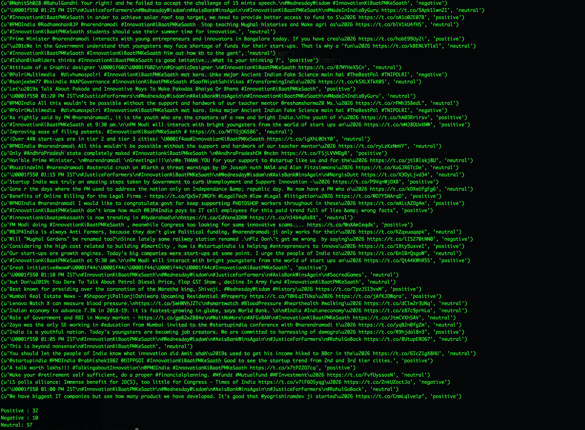

# Twitter-Sentiment-Analyzer
Python app to analyze twitter feed for tweet sentiment

ENV variables needed for twitter auth 

TWITTER_APP_KEY=<TWITTER_APP_KEY>  
TWITTER_APP_KEY_SECRET=<TWITTER_APP_KEY_SECRET>  
TWITTER_ACCESS_TOKEN=<TWITTER_ACCESS_TOKEN>  
TWITTER_ACCESS_TOKEN_SECRET=<TWITTER_ACCESS_TOKEN_SECRET>  

## Output Screen

